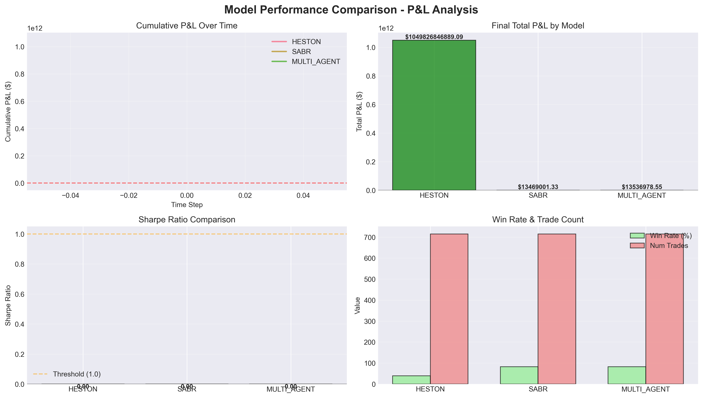

# Bitcoin Options Trading Model Comparison Report

**Generated:** 2025-10-14 23:39:21

## Executive Summary

This report compares the performance of multiple option pricing models (Heston, SABR, Local Volatility, Multi-Agent) on Bitcoin options trading.

## Performance Summary

| Model       |   Total P&L ($) |   Gross P&L ($) |   Net P&L ($) |   Sharpe Ratio |   Max Drawdown ($) |   Win Rate (%) |   Num Trades |   Trans Costs ($) |   Hedge Costs ($) |   VaR 95% ($) |
|:------------|----------------:|----------------:|--------------:|---------------:|-------------------:|---------------:|-------------:|------------------:|------------------:|--------------:|
| HESTON      |     1.04983e+12 |     1.05432e+12 |   1.04983e+12 |              0 |                  0 |           39.4 |          715 |              0.07 |       4.49488e+09 |             0 |
| SABR        |     1.3469e+07  |     1.3474e+07  |   1.3469e+07  |              0 |                  0 |           82.8 |          715 |              0.07 |    5009.57        |             0 |
| MULTI_AGENT |     1.3537e+07  |     1.3542e+07  |   1.3537e+07  |              0 |                  0 |           82.4 |          715 |              0.07 |    5023.97        |             0 |

## Key Findings

- **Best Sharpe Ratio:** HESTON (0.000)
- **Highest P&L:** HESTON (1049826846889.09)
- **Best Win Rate:** SABR (82.8)\n
## Visualizations

## Conclusion

The Multi-Agent model aims to capture market microstructure effects that traditional models may miss, potentially leading to better trading performance. Compare the Sharpe ratios and P&L to determine if the added complexity is justified.
